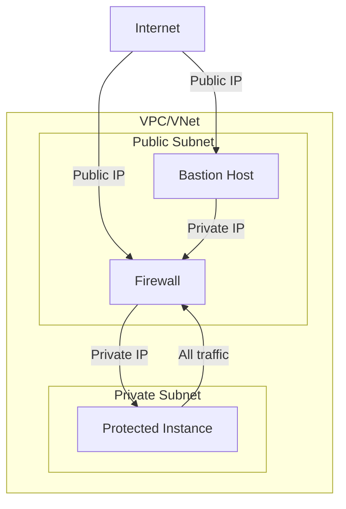

# Enforza.io Firewall PoC Terraform Configurations

This repository contains Terraform configurations for deploying a proof of concept (PoC) of the [Enforza.io](https://www.Enforza.io "Enforza.io") firewall product on two major cloud platforms: Amazon Web Services (AWS) and Microsoft Azure. The configurations are organized into two separate subfolders, each tailored to its respective cloud provider.

## Repository Structure

- `aws/`: Contains Terraform configurations for AWS deployment
- `azure/`: Contains Terraform configurations for Azure deployment

## Infrastructure Diagram

The following diagram represents the general structure of the infrastructure for both AWS and Azure deployments:

This diagram illustrates:
- A VPC/VNet with two subnets: Public and Private
- Bastion Host and Firewall in the Public Subnet, both with public IPs
- Protected Instance in the Private Subnet
- Traffic flow from the internet to the Bastion and Firewall, and from the Firewall to the Protected Instance

## Comparison of AWS and Azure Implementations

While both implementations aim to create a similar infrastructure for the Enforza.io firewall PoC, there are some key differences due to the unique characteristics of each cloud platform.

### Common Features

Both implementations create:
- A virtual network with three subnets (protected, firewall, and bastion)
- Virtual machines/instances in each subnet
- A routing mechanism to direct traffic from the protected subnet through the firewall
- Security rules to allow SSH access
- Public IPs for the bastion host and firewall

### Key Differences

1. **Networking Concepts**
   - AWS: Uses VPC (Virtual Private Cloud) and Subnets
   - Azure: Uses Virtual Network and Subnets

2. **Compute Resources**
   - AWS: EC2 Instances
   - Azure: Virtual Machines

3. **Security**
   - AWS: Security Groups
   - Azure: Network Security Groups

4. **Routing**
   - AWS: Route Tables associated with Subnets
   - Azure: Route Tables associated with Subnets, but with different configuration syntax

5. **Public IP Assignment**
   - AWS: Elastic IP associated with the Bastion and Firewall instances
   - Azure: Public IP resource associated with the Bastion and Firewall VM's network interfaces

6. **Firewall VM Configuration**
   - AWS: Uses `source_dest_check = false` on the firewall instance
   - Azure: Enables IP forwarding on the firewall VM's network interface

7. **Resource Grouping**
   - AWS: Resources are grouped by VPC
   - Azure: All resources are placed in a Resource Group

8. **Authentication**
   - AWS: Uses Access Key and Secret Key
   - Azure: Uses Service Principal (client_id, client_secret, tenant_id)

9. **Image Selection**
   - AWS: Uses data source to find the latest Ubuntu 22.04 LTS AMI
   - Azure: Specifies Ubuntu 22.04 LTS image directly

### Usage Notes

- Each subfolder contains its own README with specific instructions for deployment.
- Ensure you have the appropriate credentials and permissions for the chosen cloud platform before deploying.
- Review and adjust variables in the `variables.tf` files to match your requirements.
- Remember to create and populate the `secrets.tfvars` file as instructed in each subfolder's README.

## Choosing a Platform

- Use the AWS configuration if you're more familiar with AWS services or if your organization primarily uses AWS.
- Use the Azure configuration if you're more comfortable with Azure or if your organization is Microsoft-centric.
- Both configurations achieve similar results, so the choice often depends on your existing cloud infrastructure, team expertise, or specific requirements of the Enforza.io product.

For detailed instructions on deploying to each platform, please refer to the README files in the respective subfolders.

## Security Considerations

This PoC configuration includes public IP addresses for the bastion and firewall instances to facilitate easy access and testing. In a production environment, consider the following security enhancements:

- Use a VPN for secure access to the infrastructure instead of public IPs.
- Implement more stringent security group/network security group rules.
- Enable additional logging and monitoring.
- Regularly update and patch all systems.

## Contributing

Push requests encouraged.
